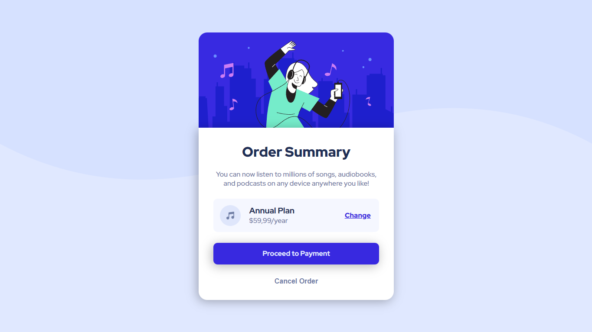

# Desafio Resumo de Pedido - Frontend-Mentor

Este é um desafio de Resumo de Pedido proposto pelo site Frontend-Mentor.

## Tabela de Conteúdos

- [Visão Geral](#visão-geral)
    - [Imagens](#imagens)
    - [Link da página](#link)
- [Processo](#processo)
    - [Linguagens utilizadas](#linguagens-utilizadas)
    - [O que aprendi](#o-que-aprendi)
    - [Possíveis evoluções](#possíveis-evoluções)
- [Autor](#autor)

## Visão-geral

### Imagens

<br>

````
Versão de Desktop
````

   

<br>

````
Versão Mobile
````

 

### Link

- Página no GitHub Pages: <a href="https://julio-mansan2.github.io/resumo-de-pedido/">Clique aqui!</a>

## Processo

### Linguagens utilizadas

<br>

- Marcações semânticas de HTML5
- Propriedades de customização do CSS3

<br>

### O que aprendi

<br>

- Posicionar um elemento à direita usando "position:absolute":

````css

.component {
    position: relative
}

.component p {
    position: absolute;
    right: 5%
}

````

<br>

- Aplicar sombras em elementos

````css

.container {
    box-shadow: -3px 4px 24px 0px rgba(0, 0, 0, 0.3);
}

````

- Alterar o cursor durante ":hover":

````css

.payment button:hover {
    cursor: pointer;
}

````

<br>

### Possíveis evoluções

<br>

- Encaixar todo o container dentro de um mesmo elemento;
- Criar medidas mais responsivas sem a necessidade de utilizar media querries;
- Posicionar elementos de maneira mais automatizada.

<br>

## Autor

GitHub - <a href="https://github.com/julio-mansan2">julio-mansan2</a> <br>
Front-end Mentor - <a href="https://www.frontendmentor.io/profile/julio-mansan2">julio-mansan2</a> <br>